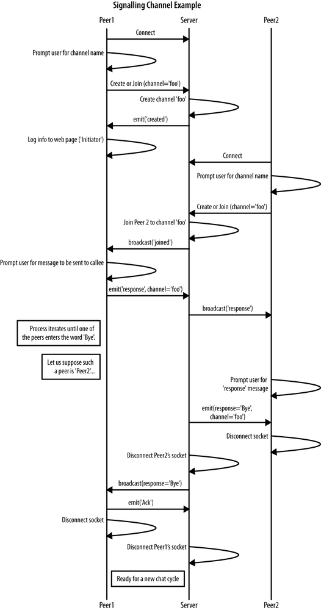

The Need for a Signaling Channel
=====

正如我们在 第3章 中预期的那样，在启用 WebRTC 的应用程序中需要一个信令通道，以允许交换会话描述和网络可达性信息。 到现在为止，我们一直坚持本地观点而忽略了这一特定方面。 事实证明这很有用，因为它使我们可以只关注 WebRTC API 的细节，而忽略所有与网络相关的方面。 现在，解决这些最后问题的时机已经成熟。 在本章中，我们将描述如何在对成功建立启用 WebRTC 的通信会话感兴趣的任何一对对等端之间创建适当的信令通道。

本章介绍的材料仅与本书的主要主题相关。 更准确地说，我们将在此通过描述涉及两个客户端和一个服务器的非常简单的 JavaScript 应用程序的设计和实现，来专注于上述信令通道的创建。 该示例本身应为读者提供一套可以在各种应用场景中轻松重用的工具。 在下一章中，我们最终将所有部分放在一起，以在分布式环境中完成 10 步 WebRTC 建立。

## 建立简单的呼叫流程

与往常一样，我们将继续采用 “按示例学习” 方法，以便让您了解如何在两个远程对等之间建立服务器辅助的信令通道。 在本章中，我们将专注于简单交互场景的实现，如 图4-1 的序列图中所示。



图4-1 信令通道示例：序列图

图片中的图表涉及三个不同的参与者：

1. 通道发起方，例如对等方，它首先主动与远端建立专用的通信通道

2. 信令服务器，管理通道创建并充当消息中继节点

3. 频道加入者，例如，远程方加入已存在的频道

这个想法是在接收到启动器发出的特定请求后，服务器根据需要创建通道。 第二个对等方加入频道后，就可以开始对话。 消息交换始终通过服务器进行，该服务器基本上充当透明的中继节点。 当对等方之一决定退出正在进行的对话时，它将在断开连接之前向服务器发出一条临时消息（图中称为Bye）。 服务器将该消息分派给远程方，在将确认发送回服务器后，远程方也将断开连接。 收到确认后，最终会触发服务器端的通道重置过程，从而使总体方案恢复到其原始配置。

首先，我们构建一个简单的 HTML5 页面（请参见 例4-1 ），其中包含一个最初为空的 `<div>` 元素，该元素将用于跟踪通过信令服务器进行交互的两个远程对等方之间通信的变化。

例4-1 简单的信令通道

```html
<!DOCTYPE html PUBLIC "-//W3C//DTD HTML 4.01 Transitional//EN"
    "http://www.w3.org/TR/html4/loose.dtd">

<html>
  <head>
    <title>WebRTC client</title>
  </head>
  <body>
    <script src='/socket.io/socket.io.js'></script>
    <div id="scratchPad"></div>
    <script type="text/javascript" src="js/simpleNodeClient.js"></script>
  </body>
</html>
```

从 HTML 代码可以看到，该页面包含两个 JavaScript 文件。 前者（`socket.io.js`）是指用于实时 Web 应用程序的著名的 `socket.io` 库。

* * *

# `socket.io` JavaScript库

`socket.io` 是一个用于实时 Web 应用程序的 JavaScript 库。 它包括两个部分：在浏览器中运行的客户端库和用于 `Node.js` 的服务器端库（请参见第70页的“ Node.js 软件平台”）。

`socket.io` 的客户端部分是一个事件驱动的库，主要使用 WebSocket 协议，但是如果需要，可以使用其他多种方法，例如 Adobe Flash 套接字， AJAX 长轮询等，同时提供相同的方法和接口。 它提供了许多高级功能，例如将多个套接字与服务器端 room 关联，广播到多个套接字，存储与特定客户端关联的数据以及管理异步 I/O 。

可以使用 node packaged modules（npm）工具轻松地安装 `socket.io`：

```shell
npm install socket.io
```

安装后，将 `socket.io.js` 文件复制到Web服务器可以在其中找到的文件夹中。

该演示应用程序还需要 `node-static` 模块，该模块也需要安装：

```shell
npm install node-static
```

* * *

后面的文件（`simpleNodeClient.js`）显示如下：

[由于这段代码太长，单独放到一个文件里了](js/simpleNodeClient.js)

该代码执行以下操作：
1. 允许客户端连接到服务器（通过 `socket.io` 库）
2. 提示用户输入要加入的频道的名称
3. 将创建或加入请求发送到服务器
4. 开始异步处理服务器发送的事件。

在本章的其余部分，我们将分步介绍完整的呼叫流程。 不过，在执行此操作之前，我们将先看一下服务器端的行为。 该服务器是通过利用 `Node.js` JavaScript 库编写的。

* * *

# Node.js 软件平台

`Node.js` 是一个功能非常强大的软件平台，允许用户使用 JavaScript 轻松构建可伸缩的服务器端应用程序。 它基于利用非阻塞 I/O 的单线程事件循环管理过程。

该库提供了内置的 HTTP 服务器实现，可以独立于第三方软件组件。 使用 Node.js，程序员只需几行代码就可以轻松实现具有自定义行为的高性能 HTTP 服务器。

* * *

让我们看一下服务器端代码。 它创建服务实例监听 8181 端口。该代码允许创建最多容纳两个客户端套接字的服务器端 “rooms”。 要求创建房间的第一个客户端是通道启动器。

创建通道后，服务器端策略如下：

1. 允许第二个到达的客户端加入新创建的频道。

2. 所有其他客户端均被拒绝进入会议室（并因此收到此类事件的通知）。

[由于这段代码太长，单独放到一个文件里了](js/NodeSocketIOServer.js)

现在，我们准备开始使用信号示例演练。

## Creating the Signaling Channel
