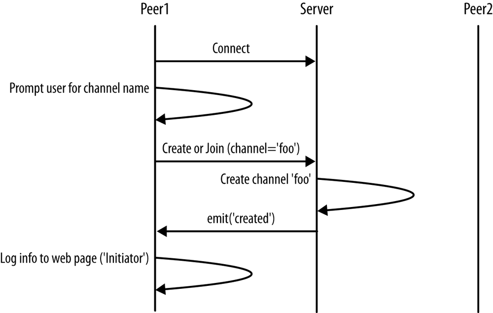
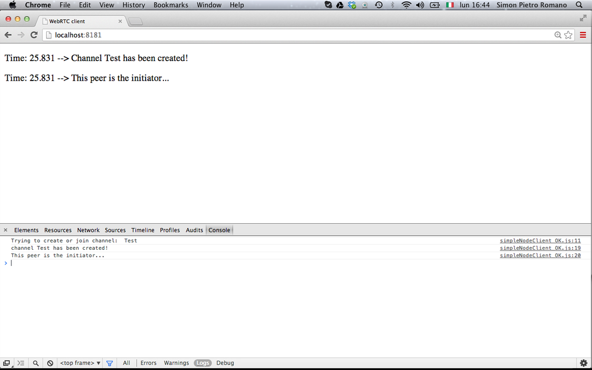
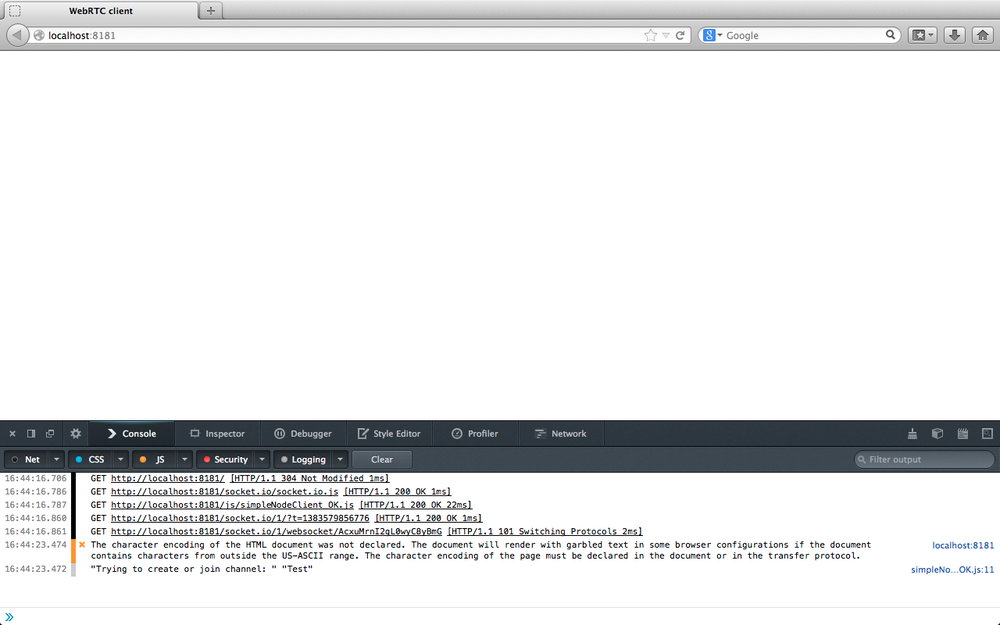
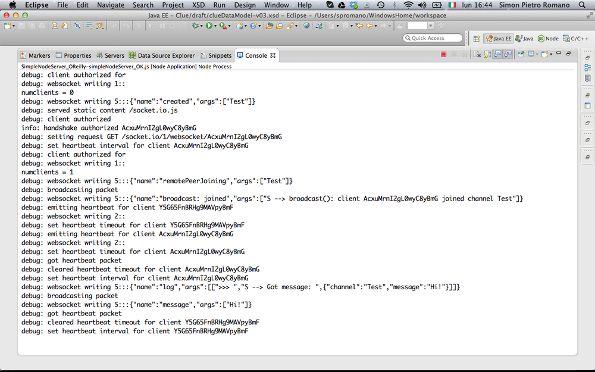
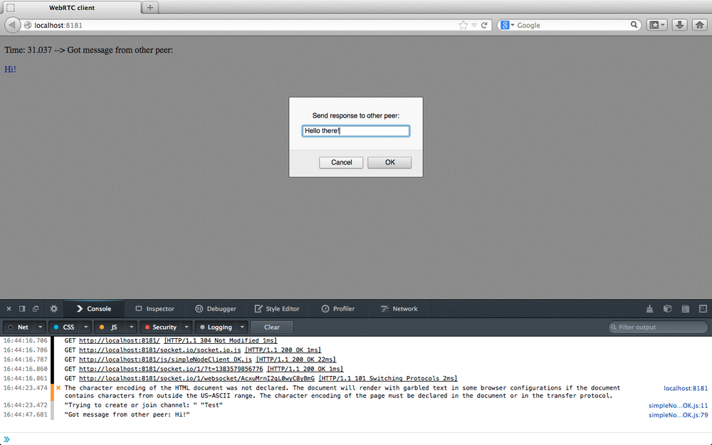
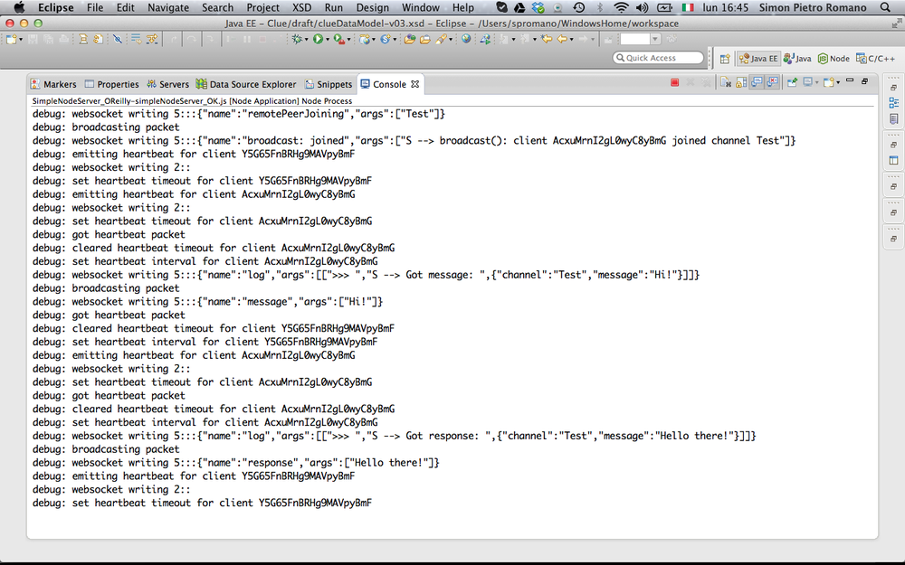
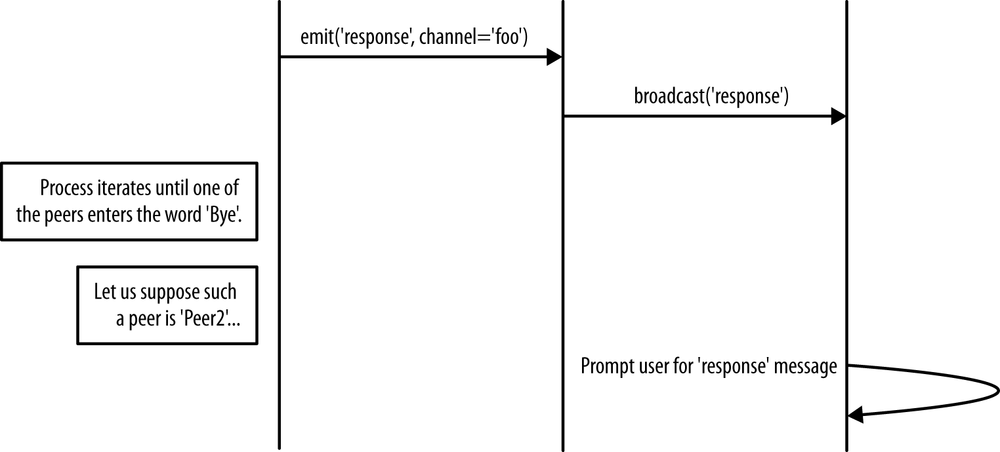
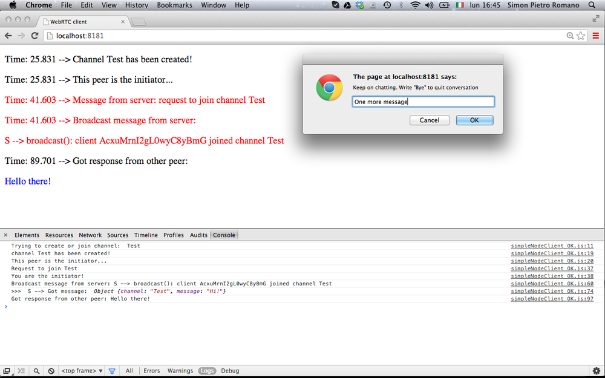
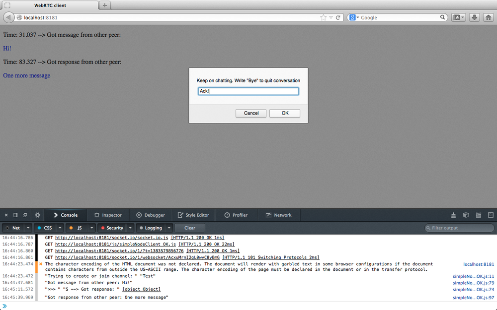
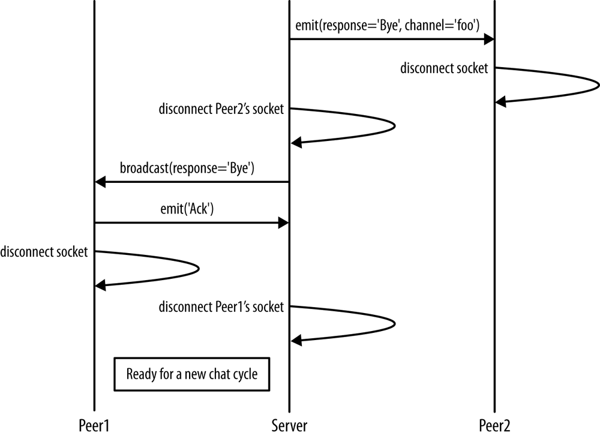

第4章 需要信令通道
=====

正如我们在 第3章 中预期的那样，在启用 WebRTC 的应用程序中需要一个信令通道，以允许交换会话描述和网络可达性信息。 到现在为止，我们一直坚持本地观点而忽略了这一特定方面。 事实证明这很有用，因为它使我们可以只关注 WebRTC API 的细节，而忽略所有与网络相关的方面。 现在，解决这些最后问题的时机已经成熟。 在本章中，我们将描述如何在对成功建立启用 WebRTC 的通信会话感兴趣的任何一对对等端之间创建适当的信令通道。

本章介绍的材料仅与本书的主要主题相关。 更准确地说，我们将在此通过描述涉及两个客户端和一个服务器的非常简单的 JavaScript 应用程序的设计和实现，来专注于上述信令通道的创建。 该示例本身应为读者提供一套可以在各种应用场景中轻松重用的工具。 在下一章中，我们最终将所有部分放在一起，以在分布式环境中完成 10 步 WebRTC 建立。

## 建立简单的呼叫流程

与往常一样，我们将继续采用 “按示例学习” 方法，以便让您了解如何在两个远程对等之间建立服务器辅助的信令通道。 在本章中，我们将专注于简单交互场景的实现，如 图4-1 的序列图中所示。


图4-1 信令通道示例：序列图

图片中的图表涉及三个不同的参与者：

1. 通道发起方，例如对等方，它首先主动与远端建立专用的通信通道

2. 信令服务器，管理通道创建并充当消息中继节点

3. 频道加入者，例如，远程方加入已存在的频道

这个想法是在接收到启动器发出的特定请求后，服务器根据需要创建通道。 第二个对等方加入频道后，就可以开始对话。 消息交换始终通过服务器进行，该服务器基本上充当透明的中继节点。 当对等方之一决定退出正在进行的对话时，它将在断开连接之前向服务器发出一条临时消息（图中称为Bye）。 服务器将该消息分派给远程方，在将确认发送回服务器后，远程方也将断开连接。 收到确认后，最终会触发服务器端的通道重置过程，从而使总体方案恢复到其原始配置。

首先，我们构建一个简单的 HTML5 页面（请参见 例4-1 ），其中包含一个最初为空的 `<div>` 元素，该元素将用于跟踪通过信令服务器进行交互的两个远程对等方之间通信的变化。

例4-1 简单的信令通道

```html
<!DOCTYPE html PUBLIC "-//W3C//DTD HTML 4.01 Transitional//EN"
    "http://www.w3.org/TR/html4/loose.dtd">

<html>
  <head>
    <title>WebRTC client</title>
  </head>
  <body>
    <script src='/socket.io/socket.io.js'></script>
    <div id="scratchPad"></div>
    <script type="text/javascript" src="js/simpleNodeClient.js"></script>
  </body>
</html>
```

从 HTML 代码可以看到，该页面包含两个 JavaScript 文件。 前者（`socket.io.js`）是指用于实时 Web 应用程序的著名的 `socket.io` 库。

* * *

# `socket.io` JavaScript库

`socket.io` 是一个用于实时 Web 应用程序的 JavaScript 库。 它包括两个部分：在浏览器中运行的客户端库和用于 `Node.js` 的服务器端库（请参见第70页的“ Node.js 软件平台”）。

`socket.io` 的客户端部分是一个事件驱动的库，主要使用 WebSocket 协议，但是如果需要，可以使用其他多种方法，例如 Adobe Flash 套接字， AJAX 长轮询等，同时提供相同的方法和接口。 它提供了许多高级功能，例如将多个套接字与服务器端 room 关联，广播到多个套接字，存储与特定客户端关联的数据以及管理异步 I/O 。

可以使用 node packaged modules（npm）工具轻松地安装 `socket.io`：

```shell
npm install socket.io
```

安装后，将 `socket.io.js` 文件复制到Web服务器可以在其中找到的文件夹中。

该演示应用程序还需要 `node-static` 模块，该模块也需要安装：

```shell
npm install node-static
```

* * *

后面的文件（`simpleNodeClient.js`）显示如下：

[由于这段代码太长，单独放到一个文件里了](js/simpleNodeClient.js)

该代码执行以下操作：
1. 允许客户端连接到服务器（通过 `socket.io` 库）
2. 提示用户输入要加入的频道的名称
3. 将创建或加入请求发送到服务器
4. 开始异步处理服务器发送的事件。

在本章的其余部分，我们将分步介绍完整的呼叫流程。 不过，在执行此操作之前，我们将先看一下服务器端的行为。 该服务器是通过利用 `Node.js` JavaScript 库编写的。

* * *

# Node.js 软件平台

`Node.js` 是一个功能非常强大的软件平台，允许用户使用 JavaScript 轻松构建可伸缩的服务器端应用程序。 它基于利用非阻塞 I/O 的单线程事件循环管理过程。

该库提供了内置的 HTTP 服务器实现，可以独立于第三方软件组件。 使用 Node.js，程序员只需几行代码就可以轻松实现具有自定义行为的高性能 HTTP 服务器。

* * *

让我们看一下服务器端代码。 它创建服务实例监听 8181 端口。该代码允许创建最多容纳两个客户端套接字的服务器端 “rooms”。 要求创建房间的第一个客户端是通道启动器。

创建通道后，服务器端策略如下：

1. 允许第二个到达的客户端加入新创建的频道。

2. 所有其他客户端均被拒绝进入会议室（并因此收到此类事件的通知）。

[由于这段代码太长，单独放到一个文件里了](js/NodeSocketIOServer.js)

现在，我们准备开始使用信号示例演练。

## 创建信令信道

如 图4-2 所示，此处我们将重点放在示例调用流程的第一步。

让我们假设使用 Chrome 浏览器的第一个客户端加载 例4-1 的 HTML5 页面。 该页面首先连接到服务器，然后提示用户输入频道名称（图4-3）：

```javascript
// Connect to server
var socket = io.connect('http://localhost:8181');

// Ask channel name from user
channel = prompt("Enter signaling channel name:");
```



图4-2 第一步：创建频道


图4-3 在 Chrome 中加载的示例页面（渠道发起者）

用户填写频道名称字段并单击 “OK” 按钮后，页面中的 JavaScript 代码将向服务器发送一条 `create` 或 `join` 消息：

```javascript
if (channel !== "") {
  console.log('Trying to create or join channel: ', channel);
  // Send 'create or join' to the server
  socket.emit('create or join', channel);
}
```

收到客户的请求后，服务器将执行以下操作：

1. 验证所提及的渠道是一个全新的通道（即其中没有客户）
2. 将服务器端 room 与通道关联
3. 允许发出请求的客户端加入通道
4. 向客户端发送一条名为 `created` 的通知消息

以下代码段显示了此操作序列：

```javascript
socket.on('create or join', function (channel) {
  var numClients = io.sockets.clients(channel).length;
  console.log('numclients = ' + numClients);

  // First client joining...
  if (numClients == 0) {
    socket.join(channel);
    socket.emit('created', channel);
...
```

图4-4 显示了执行上述操作后的服务器控制台。

当启动客户端收到服务器的答复时，它仅将事件记录在 JavaScript 控制台上和 HTML5 页面中包含的 `<div>` 元素内：

```javascript
// Handle 'created' message
socket.on('created', function (channel) {
  console.log('channel ' + channel + ' has been created!');
  console.log('This peer is the initiator...');
  // Dynamically modify the HTML5 page

  div.insertAdjacentHTML( 'beforeEnd', '<p>Time: ' + (performance.now() / 1000).toFixed(3) + ' --> Channel ' + channel + ' has been created! </p>');
  div.insertAdjacentHTML( 'beforeEnd', '<p>Time: ' + (performance.now() / 1000).toFixed(3) + ' --> This peer is the initiator...</p>');
});
```


图4-4 信令服务器管理发起者的请求

上述情况如 图4-5 所示。



图4-5 频道创建后发起者的窗口

## 加入信令信道

现在，我们转到第二个客户端，即通道连接器，重点关注 图4-6 所示的呼叫流程部分。


图4-6 加入已经存在的通道

为了完整起见，我们这次将使用 Firefox 作为客户端浏览器，在加载应用程序页面后，其外观如 图4-7 所示。

如前所述，客户端首先连接到服务器，然后发送创建或加入请求。 由于这次请求方不是发起方，因此服务器的行为将由以下代码段驱动：

```javascript
...
} else if (numClients == 1) {
  // Inform initiator...
  io.sockets.in(channel).emit('remotePeerJoining', channel);
  // Let the new peer join channel
  socket.join(channel);
  socket.broadcast.to(channel).emit('broadcast: joined', 'S --> broadcast(): client ' + socket.id + ' joined channel ' + channel);
...
```

基本上，服务器将：

1. 通知通道发起者新加入请求的到来。
2. 允许新客户进入已经存在的房间。
3. 更新（通过广播消息）频道启动程序有关加入操作成功完成的信息，使其准备开始新的对话。


图4-7 在 Firefox 中加载的示例页面（通道连接器）

图4-8 报告了这样的一系列操作，该图显示了呼叫流程此阶段的服务器控制台。


图4-8 信令服务器管理加入者的请求

图4-9 和 图4-10 分别显示了加入者和发起者的窗口，在加入者和发起者成功加入后者创建的信令通道之后。 正如读者所认识到的那样，此服务器端操作序列在启动器的 HTML5 页面（图4-10）中以红色报告，现在提示用户要在服务器中介的通信路径上交换第一条消息。



图4-9 加入频道后的加入者窗口


图4-10 设置通道后开始对话

## 开始服务器中介的对话

现在，我们进入了 图4-11 中报告的呼叫流程阶段，该阶段基本上捕获了应用程序的核心。 实际上，在此阶段中，发起方将第一条消息发送到连接器，该连接器首先被通知此事件，然后提示您引入适当的 `answer` 。


图4-11 开始会话

像往常一样，客户端会检索用户的输入，并向服务器发出一条消息，以便正确分派它。 在服务器端，接收到的消息只是在频道上 广播（请注意，在仅由两个对等方组成的通道上进行广播等效于向消息本身发送者以外的对等方发送通知）：

```javascript
// Handle 'message' messages
socket.on('message', function (message) {
  log('S --> Got message: ', message);

  socket.broadcast.to(message.channel).emit('message', message.message);
});
```

图4-12 的控制台快照中说明了上述服务器的行为。



图4-12 信令服务器充当中继节点

图4-13 显示了刚刚接收到服务器中继的消息的远程对等方（连接程序）。



图4-13 远程对等方从信令服务器接收中继消息

如图所示，将执行以下操作：
1. 在 JavaScript 控制台和 HTML5 页面上记录接收到的消息
2. 提示接收器正确输入
3. 将接收方的答案发送回发送方（通过信令信道）

这样的序列由以下代码片段驱动：

```javascript
// Handle 'message' message
socket.on('message', function (message) {
  console.log('Got message from other peer: ' + message);
  div.insertAdjacentHTML( 'beforeEnd', '<p>Time: ' + (performance.now() / 1000).toFixed(3) + ' --> Got message from other peer: </p>');
  div.insertAdjacentHTML( 'beforeEnd', '<p style="color:blue">' + message + '</p>');

  // Send back response message:
  // 1. Get response from user
  var myResponse = prompt('Send response to other peer:', "");
  // 2. Send it to remote peer (through server)
  socket.emit('response', {
    channel: channel,
    message: myResponse
  });
});
```

接收器在 图4-14 的提示窗口中单击 OK 按钮后，响应消息就会向服务器发出，服务器将其转发到远程方：

```javascript
// Handle 'response' messages
socket.on('response', function (response) {
  log('S --> Got response: ', response);

  // Just forward message to the other peer
  socket.broadcast.to(response.channel).emit('response', response.message);
});
```

服务器的控制台快照在 图4-14 中再次说明了此行为。



图4-14 信令服务器中继远程对等方的响应


## 继续跨频道聊天

现在，我们处于应用程序的稳态部分（图4-15），两个对等方只是轮流要求服务器将消息中继到另一方。



图4-15 稳定状态下的信令信道使用

邮件交换是通过以下代码在客户端实现的：

```javascript
...
// Handle 'response' message
socket.on('response', function (response) {
  console.log('Got response from other peer: ' + response);

  div.insertAdjacentHTML( 'beforeEnd', '<p>Time: ' + (performance.now() / 1000).toFixed(3) + ' --> Got response from other peer: </p>');

  div.insertAdjacentHTML( 'beforeEnd', '<p style="color:blue">' + response + '</p>');

  // Keep on chatting
  var chatMessage = prompt('Keep on chatting. Write "Bye" to quit conversation', "");

  ...
  ...

    // Keep on going: send response back to remote party (through server)
    socket.emit('response', {
      channel: channel,
      message: chatMessage
    });
  }
});
```

基本上，在接收到新消息后，每个对等方都会执行通常的日志记录操作，然后提示用户进行新的输入。 只要插入的文本的值不是 `Bye` ，它就会向对方发送新消息。 图4-16 显示了在通道中发出新消息之前发起者的窗口。



图4-16 继续聊天（发起方）

图4-17 依次显示了接收到这样的消息后的服务器控制台，该消息照常广播到远程方。


图4-17 继续聊天（服务器端）

最后，图4-18 显示了接收方接收到的中继消息。



图4-18 继续聊天（加入方）

## 关闭信令通道

现在，我们准备分析通道拆除，如图4-19的呼叫流摘要所述。



图4-19 关闭信令通道

拆卸过程实际上是通过在两个浏览器之一中插入 `Bye` 消息触发的（请参见 图4-20 ）。

幕后发生的事情如下：

```javascript
// User wants to quit conversation: send 'Bye' to remote party
if(chatMessage == "Bye") {
  div.insertAdjacentHTML( 'beforeEnd', '<p>Time: ' + (performance.now() / 1000).toFixed(3) + ' --> Sending "Bye" to server...</p>');
  console.log('Sending "Bye" to server');

  socket.emit('Bye', channel);

  div.insertAdjacentHTML( 'beforeEnd', '<p>Time: ' + (performance.now() / 1000).toFixed(3) + ' --> Going to disconnect...</p>');
  console.log('Going to disconnect...');
  // Disconnect from server
  socket.disconnect();
}
```


图4-20。 通过 `Bye` 消息关闭通道

从代码中可以看到，断开连接的客户端首先在通道上发送 `Bye` 消息，然后立即关闭 Web socket（图4-21）。

服务器收到 “`Bye`” 消息后，它将首先将其中继到远程方，然后关闭通向断开连接客户端的通信通道：

```javascript
// Handle 'Bye' messages
socket.on('Bye', function(channel) {
  // Notify other peer
  socket.broadcast.to(channel).emit('Bye');

  // Close socket from server's side
  socket.disconnect();
});
```


图4-21 发起方断开连接

最后，让我们分析对等方从远程方收到再见消息的行为。 对等方首先记录有关接收到的消息的信息（在 JavaScript 控制台上和 HTML5 页面内）：

```javascript
// Handle 'Bye' message
socket.on('Bye', function () {
  console.log('Got "Bye" from other peer! Going to disconnect...');

  div.insertAdjacentHTML( 'beforeEnd', '<p>Time: ' + (performance.now() / 1000).toFixed(3) + ' --> Got "Bye" from other peer!</p>');
...
```

然后，将 `Ack` 消息发送回服务器以确认收到断开连接请求：

```javascript
div.insertAdjacentHTML( 'beforeEnd', '<p>Time: ' + (performance.now() / 1000).toFixed(3) + ' --> Sending "Ack" to server</p>');

// Send 'Ack' back to remote party (through server)
console.log('Sending "Ack" to server');

socket.emit('Ack');

// Disconnect from server
div.insertAdjacentHTML( 'beforeEnd', '<p>Time: ' + (performance.now() / 1000).toFixed(3) + ' --> Going to disconnect...</p>');

console.log('Going to disconnect...');

socket.disconnect();
```

最后，接收方断开与服务器的连接：

```javascript
...
  console.log('Going to disconnect...');
  socket.disconnect();
});
```

在 图4-22 的快照中可以轻松识别上述操作顺序。


图4-22 远程对等方处理中继断开消息并断开连接

最后的操作在服务器端进行。 在控制台上记录了 `Ack` 消息的接收情况（请参见 图4-23 ），并且该通道最终被销毁：

```javascript
// Handle 'Ack' messages
socket.on('Ack', function () {
  console.log('Got an Ack!');
  // Close socket from server's side
  socket.disconnect();
});
```


图4-23 服务器端的关闭通道

