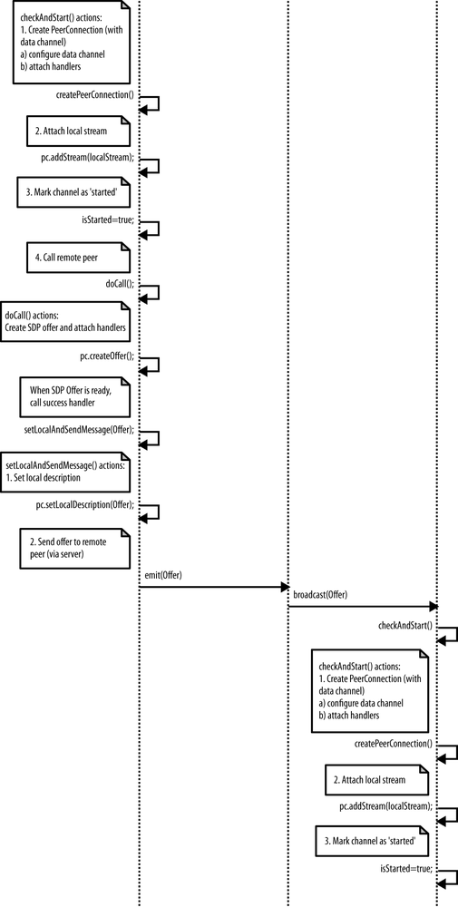
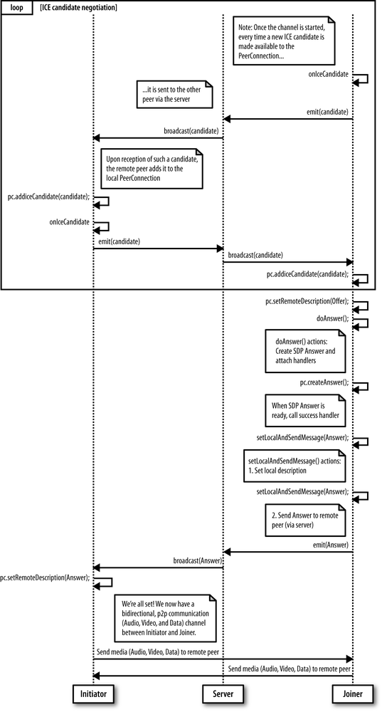
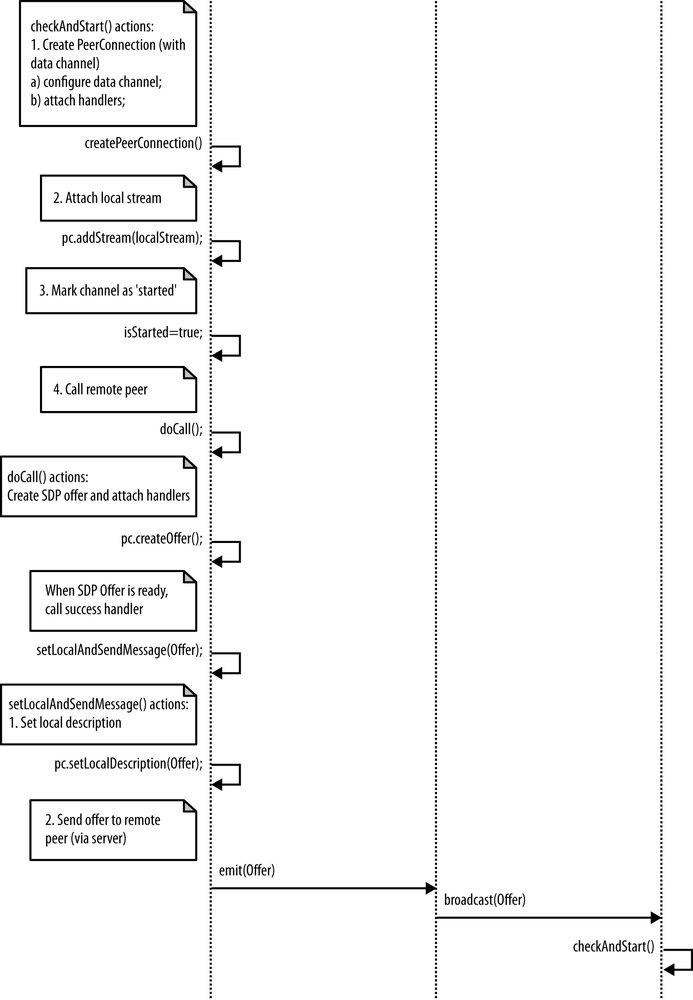
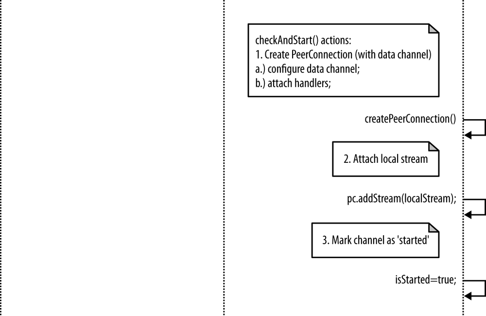

放在一起：Scratch 的第一个 WebRTC 系统
=====

我们终于准备好将所有部分放在一起，并构建我们的第一个 WebRTC 应用程序。 在本章中，通过利用像我们在第4章中描述的那样的信令服务器，我们将在分布式方案中实现 Browser RTC Trapezoid。 基本上，我们将以第3章的运行示例为例，并使其也超出本地视角的范围。


我们将展示如何使用信令信道来允许两个对等方交换用户媒体信息，会话描述 和 ICE协议候选者。 我们还将重点介绍如何仅在设置阶段证明信令服务器角色是基础。 实际上，一旦成功交换了上述信息，通信模式便切换为纯对等，服务器本身不参与实际的数据交换阶段。


## 完整的 WebRTC 呼叫流程

图5-1、5-2 和 5-3 提供了与完整的 WebRTC 呼叫流程相关联的全景图，该流程涉及一个信道发起方，一个信道连接器以及在信道建立时在它们之间中继消息的信令服务器。


图5-1 WebRTC 调用流程：序列图，第 1 部分



图5-2 WebRTC 调用流程：序列图，第 2 部分



图5-3 WebRTC 调用流程：序列图，第 3 部分


序列图通过以下步骤变化：

1. 发起方连接到服务器，并使其创建信令通道。
2. 发起者（在获得用户同意后）可以访问用户的媒体。
3. Joiner 连接到服务器并加入频道。
4. 当 Joiner 还可以访问本地用户的媒体时，将通过服务器将一条消息发送给 Initiator ，从而触发协商过程：
  - 发起方创建 PeerConnection ，向其添加本地流，创建 SDP `offer`，然后通过信令服务器将其发送到 Joiner。
  - 收到 SDP `offer` 后，Joiner 会通过创建 `PeerConnection` 对象，向其添加本地流并构建 SDP `answer` 以（通过服务器）发送回远程方来镜像发起方的行为。
5. 在协商过程中，双方利用信令服务器交换网络可达性信息（以 ICE 协议候选地址的形式）。
6. 当发起方 Joiner 收到 `offer` 并返回 `answer` 时，协商过程结束：双方通过利用各自的 `PeerConnection` 对象切换到对等通信，`PeerConnection` 对象还配备了可用于以下目的的数据通道： 直接交换短信。


在以下各节中，我们将通过详细分析每个步骤来逐步完成这些步骤。 在进行此操作之前，让我们介绍作为本章的运行示例而设计的简单 Web 应用程序。 HTML 代码在 例5-1 中报告。


例5-1 简单的 WebRTC 应用程序

```html
<!DOCTYPE html>
<html>
  <head>
    <title>Very simple WebRTC application with a Node.js signaling server</title>
  </head>
  <body>
    <div id='mainDiv'>
      <table border="1" width="100%">
        <tr>
          <th>
            Local video
          </th>
          <th>
            Remote video
          </th>
        </tr>
        <tr>
          <td>
            <video id="localVideo" autoplay></video>
          </td>
          <td>
            <video id="remoteVideo" autoplay></video>
          </td>
        </tr>
        <tr>
          <td align="center">
            <textarea rows="4" cols="60"id="dataChannelSend" disabledplaceholder="This will be enabled once the data channel is up..."></textarea>
          </td>
          <td align="center">
            <textarea rows="4" cols="60"id="dataChannelReceive" disabled></textarea>
          </td>
        </tr>
        <tr>
          <td align="center">
            <button id="sendButton" disabled>Send</button>
          </td>
          <td>
          </td>
        </tr>
      </table>
    </div>
    <script src='/socket.io/socket.io.js'></script>
    <script src='js/lib/adapter.js'></script>
    <script src='js/completeNodeClientWithDataChannel.js'></script>
  </body>
</html>
```

本地视频以及本地数据通道信息显示在页面的左侧，而远程视频和数据则显示在窗口的右侧。 该页面涉及三个脚本文件，第一个是已经介绍的 socket.io 库（请参阅第66页的 “ socket.io JavaScript 库” ）。 至于第二个文件（adapter.js），它是一个方便的 JavaScript 填充程序库，可通过适当抽象浏览器前缀以及其他浏览器差异和供应商当前解释规格的方式更改，来帮助程序员。 最后，`completeNodeClientWithDataChannel.js` 包含实际的客户端代码，并在 例5-2 中完整介绍了该示例，以使读者受益。 在本章的其余部分中，我们将深入研究该文件的详细信息。


例5-2 `completeNodeClientWithDataChannel.js`

[由于这段代码太长，单独放到一个文件里了](js/completeNodeClientWithDataChannel.js)

根据 第4章 中包含的信息，读者在理解信令服务器的行为时应该不会遇到任何问题，信令服务器已作为 Node.js 应用程序编写，其代码复制如下：

```javascript
var static = require('node-static');
var http = require('http');

// Create a node-static server instance
var file = new(static.Server)();

// We use the http module’s createServer function and
// rely on our instance of node-static to serve the files
var app = http.createServer(function (req, res) {
  file.serve(req, res);
}).listen(8181);

// Use socket.io JavaScript library for real-time web applications
var io = require('socket.io').listen(app);

// Let's start managing connections...
io.sockets.on('connection', function (socket) {
  // Handle 'message' messages
  socket.on('message', function (message) {
    log('S --> got message: ', message);

    // channel-only broadcast...
    socket.broadcast.to(message.channel).emit('message', message);
  });

  // Handle 'create or join' messages
  socket.on('create or join', function (room) {
    var numClients = io.sockets.clients(room).length;

    log('S --> Room ' + room + ' has ' + numClients + ' client(s)');
    log('S --> Request to create or join room', room);

    // First client joining...
    if (numClients == 0) {
      socket.join(room);
      socket.emit('created', room);
    } else if (numClients == 1) {
      // Second client joining...
      io.sockets.in(room).emit('join', room);
      socket.join(room);
      socket.emit('joined', room);
    } else {
      // max two clients
      socket.emit('full', room);
    }

  });

  function log() {
    var array = [">>> "];
    for (var i = 0; i < arguments.length; i++) {
      array.push(arguments[i]);
    }
    socket.emit('log', array);
  }
});
```

基本上，服务器负责两种通道管理操作（在收到发起方的请求后创建，在第二个对等方到达时加入）和消息中继（在会话建立时）。 正如已经预期的那样，在成功实例化共享信令通道的两个浏览器之间的对等会话之后，它立即完成任务。

现在，让我们开始完整的 WebRTC 示例演练。


## 发起者加入频道

图5-4 显示了启动上一节中描述的示例 WebRTC 应用程序时，发起方采取的动作序列。


图5-4 发起者加入频道

如图所示，将网页加载到浏览器中后，首先会提示用户输入频道名称。 然后，对等方连接到信令服务器，并向其发送创建或加入消息。 这在下面的 JavaScript 代码段中进行了报告，并在 图5-5 的快照中也进行了显示：

```javascript
// Let's get started: prompt user for input (room name)
var room = prompt('Enter room name:');

// Connect to signalling server
var socket = io.connect("http://localhost:8181");

// Send 'create' or 'join' message to singnalling server
if (room !== '') {
  console.log('Create or join room', room);
  socket.emit('create or join', room);
}
```


图5-5 发起者在 Chrome 浏览器中加入

当服务器收到创建或加入消息时，它将对等方识别为发起方，并创建与所需通道关联的服务器端房间。 最终它将创建的消息发送回客户端：

```javascript
// Handle 'create or join' messages
socket.on('create or join', function (room) {
  var numClients = io.sockets.clients(room).length;
  log('S --> Room ' + room + ' has ' + numClients + ' client(s)');
  log('S --> Request to create or join room', room);

  // First client joining...
  if (numClients == 0){socket.join(room);
    socket.emit('created', room);
  } else if (numClients == 1) {

  ...
```

图5-6 显示了此阶段的服务器控制台。


图5-6 信令服务器创建信令通道

现在我们到达了客户端从服务器获取一条创建的消息并意识到它将扮演通道发起者的角色：

```javascript
// Handle 'created' message coming back from server:
// this peer is the initiator
socket.on('created', function (room) {
  console.log('Created room ' + room);
  isInitiator = true;
  ...
```

客户端执行的下一个动作是通过 `getUserMedia()` API调用来访问用户的媒体：

图5-7 显示了在获得用户同意之前浏览器的窗口。


图5-7 发起人征求用户同意

以下快照报告了 `handleUserMedia()` 成功处理程序执行的操作：（1）检索到的视频流附加到HTML页面的本地 `<video>` 元素； （2）获取到的用户媒体消息发送给服务器。

```javascript
// Call getUserMedia()
navigator.getUserMedia(constraints, handleUserMedia, handleUserMediaError);
console.log('Getting user media with constraints', constraints);
```

这些操作中的第一个操作的效果如 图5-8 所示。


图5-8 用户同意后的发起者

下面是用于向服务器发送消息的 JavaScript 代码：

```javascript
// Send message to the other peer via the signaling server
function sendMessage(message){
  console.log('Sending message: ', message);
  socket.emit('message', message);
}
```

以下摘录中显示了与接收通用消息相关的服务器端行为。 服务器首先将一条日志消息（在 图5-8 下部的浏览器控制台中也可见）发送回客户端，然后将接收到的消息广播到远程方（如果存在）（不是这种情况） 在呼叫流程的这一点）：

```javascript
// Handle 'message' messages
socket.on('message', function (message) {
  log('S --> got message: ', message);
  // channel-only broadcast...
  socket.broadcast.to(message.channel).emit('message', message);
});
```

通道启动程序执行的最后一个操作是 `checkAndStart()` 函数的执行，由于通道尚未准备好，在整个调用流程的此阶段，该函数实际上不执行任何操作：

```javascript
function checkAndStart() {
  // Do nothing if channel not ready...
  if (!isStarted && typeof localStream != 'undefined' && isChannelReady) {
    ...
```

## 加入者加入通道

现在，让我们找出第二个同伴加入该频道时发生的情况。 相关的动作顺序如 图5-9 所示。

该图的第一部分反映了发起方的行为，提示用户输入频道名称，并向服务器发送创建或加入消息。 这次在服务器端进行消息处理（图5-10 中报告了服务器的控制台），设想将联接消息发送到发起方（后者现在可以将通道标记为就绪），紧接着是对 Joiner 的联接响应 ：

```javascript
} else if (numClients == 1) {
  // Second client joining...
  io.sockets.in(room).emit('join', room);
  socket.join(room);
  socket.emit('joined', room);
} else {
  // max two clients
```

以下摘录显示了与接收加入消息关联的客户端操作：

```javascript
// Handle 'join' message coming back from server:
// another peer is joining the channel
socket.on('join', function (room){
  console.log('Another peer made a request to join room ' + room);
  console.log('This peer is the initiator of room ' + room + '!');
  isChannelReady = true;
});
```

最后，以下 JavaScript 说明了客户端如何意识到自己在扮演 Joiner 的角色，因为它返回了对 create 或 join 请求的联接响应：


图5-9 加入者加入频道

```javascript
// Handle 'joined' message coming back from server:
// this is the second peer joining the channel
socket.on('joined', function (room) {
  console.log('This peer has joined room ' + room);
  isChannelReady = true;
});
```


图5-10 信令服务器管理 Joiner 的请求


从这一点开始， Joiner 在协商的此阶段执行的其余操作与我们在上一节中查看 Initiator 的角色时所描述的操作完全相同：（1）访问本地媒体（等待用户的访问） 同意）; （2）将本地视频附加到 HTML 页面； （3）通过信令服务器将获取的用户媒体消息发送给远程对等体。


## 发起方开始协商

接收到服务器中继的用户媒体消息后，发起者将再次激活 `checkAndStart()` 函数，由于边界条件现在已更改，因此这一次实际上已执行：通道已准备就绪，本地流已 由 `getUserMedia()` API 调用提供。

图5-11 中的 UML 快照和以下 JavaScript 代码指示发起方（1）创建了 `PeerConnection` 对象； （2）将频道标记为已开始； （3）激活 `doCall()` JavaScript 函数。

```javascript
// Channel negotiation trigger function
function checkAndStart() {
  if (!isStarted && typeof localStream != 'undefined' && isChannelReady) {
    createPeerConnection();
    isStarted = true;
    if (isInitiator) {
      doCall();
    }
  }
}
```

深入研究上述操作的详细信息，以下代码摘录显示，为正确管理ICE候选地址以及远程流的添加和删除，`PeerConnection` 对象附加了许多处理程序。 此外，`PeerConnection` 还配备了一个数据通道，该通道将用于以对等方式与 Joiner 交换文本数据：

```javascript
function createPeerConnection() {
  try {
    pc = new RTCPeerConnection(pc_config, pc_constraints);

    pc.addStream(localStream);

    pc.onicecandidate = handleIceCandidate;
    console.log('Created RTCPeerConnnection with:\n' + '  config: \'' + JSON.stringify(pc_config) + '\';\n' + '  constraints: \'' + JSON.stringify(pc_constraints) + '\'.');
  } catch (e) {
    console.log('Failed to create PeerConnection, exception: ' + e.message);
    alert('Cannot create RTCPeerConnection object.');
    return;
  }

  pc.onaddstream = handleRemoteStreamAdded;
  pc.onremovestream = handleRemoteStreamRemoved;

  if (isInitiator) {
    try {
      // Create a reliable data channel
      sendChannel = pc.createDataChannel("sendDataChannel",{reliable: true});
      trace('Created send data channel');
    } catch (e) {
      alert('Failed to create data channel. ');
      trace('createDataChannel() failed with exception: ' + e.message);
    }
    sendChannel.onopen = handleSendChannelStateChange;
    sendChannel.onmessage = handleMessage;
    sendChannel.onclose = handleSendChannelStateChange;
  } else {
    // Joiner
    pc.ondatachannel = gotReceiveChannel;
  }
}
```



图5-11 发起方开始协商

关于 `doCall()` 函数，它基本上在可用的 `PeerConnection` 上调用 `createOffer()` 方法，要求浏览器正确构建一个 SDP （会话描述协议）对象，该对象代表发起方的媒体和要传达给远程方的功能：

```javascript
function doCall() {
  console.log('Creating Offer...');
  pc.createOffer(setLocalAndSendMessage, onSignalingError, sdpConstraints);
}
```

与此调用关联的成功处理程序负责将浏览器提供的 SDP 与 `PeerConnection` 相关联，并通过信令服务器将其传输到远程对等方：

```javascript
function setLocalAndSendMessage(sessionDescription) {
  pc.setLocalDescription(sessionDescription);
  sendMessage(sessionDescription);
}
```

## 加入者管理发起者的 `offer`

图5-12 显示了 Joiner 在收到发起者的 SDP offer 后采取的操作。

实际上，如下面的 JavaScript 代码片段所示，当 offer 到达 Joiner 时，首先运行 `checkAndStart()` 函数：

```javascript
// Receive message from the other peer via the signalling server
socket.on('message', function (message) {

  console.log('Received message:', message);
  if (message === 'got user media') {

    ...

  } else if (message.type === 'offer') {
      if (!isInitiator && !isStarted) {
        checkAndStart();
      }

      pc.setRemoteDescription(new RTCSessionDescription(message));
      doAnswer();

  } else if (message.type === 'answer' && isStarted) {

  ...
```



图5-12 参加发起人 offer 后，Joiner 的操作

当由 Joiner 执行时，此函数将创建 Joiner 的 `PeerConnection` 对象并设置 `isStarted` 标志：

```javascript
function checkAndStart() {
  if (!isStarted && typeof localStream != 'undefined' && isChannelReady) {
    createPeerConnection();
    isStarted = true;
    if (isInitiator) {
      ...
    }
  }
}
```

如第121页 的 “ Joiner 的 `answer` ” 中所述，一旦使用 `checkAndStart()` 函数完成，Joiner 仍然必须配置其本地 `PeerConnection` 并正确构建 SDP `answer` 以发送回发起方。 在下文中，我们将首先简要讨论双方所需的 ICE 候选人交换程序。

