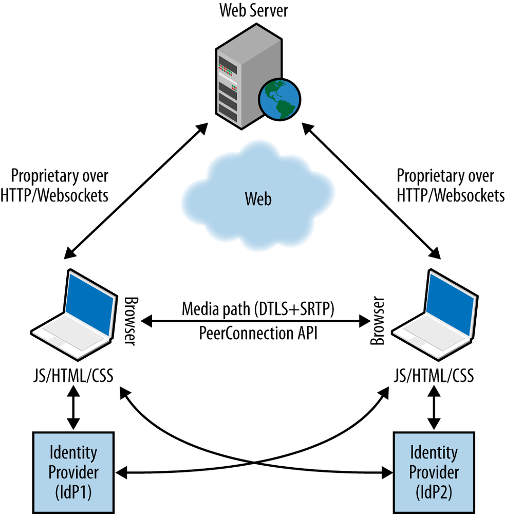

WebRTC API 的高级功能简介
=====

在前面的章节中，我们描述并讨论了一个简单的场景：一个浏览器直接与另一个浏览器对话。 WebRTC API 是围绕一对一通信方案设计的，这表示最易于管理和部署。 如前几章所述，基本的 WebRTC 功能足以实现一对一的场景，因为浏览器的内置音频和视频引擎通过调整媒体流以使其与视频流匹配，从而优化了媒体流的传递。 可用带宽并适合当前的网络条件。

在这最后一章中，我们将简要讨论会议场景，然后列出 W3C WebRTC 工作组（在2014年初撰写本文时）仍在积极讨论和开发中的其他高级 WebRTC 功能和机制。

## 网络会议

在 WebRTC 会议场景（或 N 向呼叫）中，每个浏览器必须接收和处理其他 N-1 个浏览器生成的媒体流，并将其自己生成的媒体流传递给 N-1 个浏览器（即 应用层拓扑是网状网络(mesh network)）。 尽管这是一个非常简单的方案，但是对于浏览器来说却很难管理，同时又要求线性增加网络带宽可用性。

由于这些原因，视频会议系统通常依赖于星形拓扑，其中每个对等方都连接到专用服务器，该服务器同时负责：

* 与网络中的所有其他对等方协商参数
* 控制会议资源
* 汇总（或混合）各个流
* 向参加会议的每个对等方分配适当的混合流

传送单个流显然会减少会议中涉及的每个对等方所需的带宽量和 CPU （以及GPU（图形处理单元））资源的数量。 专用服务器可以是对等方之一，也可以是专门为处理和分发实时数据而优化的服务器。 在后一种情况下，服务器通常被标识为多点控制单元（MCU）。

WebRTC API 没有提供任何特定的机制来辅助会议方案。 识别 MCU 的标准和过程委托给应用程序。 但是，这是一个巨大的工程挑战，因为它设想在 WebRTC 对等通信模型中引入集中式基础架构。 这种挑战的优势显然在于考虑到与代理服务器建立对等连接的能力，通过代理服务器本身提供的附加服务，可以增加 WebRTC 的优势。

我们计划在本书的下一版中为视频会议专门介绍至少一章。

## 身份认证

在两个 WebRTC 浏览器之间执行的 DTLS 握手依赖于自签名证书。 因此，由于没有明确的信任链，因此此类证书不能用于对等体进行身份验证。

W3C WebRTC 工作组实际上正在研究基于 Web 的身份提供程序（IdP）机制。 想法是，每个浏览器都与支持协议（例如，OpenId 或 BrowserID ）的 IdP 有关系，该协议可用于在与其他对等方进行交互时声明其自身的身份。 与 IdP 的交互的设计方式是使浏览器与任何特定的身份提供者脱钩（即，参与通信的每个浏览器可能与不同的 IdP 有关系）。

> ### **Note :**
> `setIdentityProvider()` 方法设置用于给定 `PeerConnection` 对象的身份提供者。 如果已经为特定的 IdP 配置了浏览器，则应用程序无需调用此调用。在这种情况下，已配置的 IdP 将用于获取断言。

发送 Offer 的浏览器充当身份验证方（AP），并从 IdP 获得将其身份绑定到自己的指纹（在 DTLS 握手期间生成）的身份声明。 然后将此身份声明附加到要约。

> ### **Note :**
> `getIdentityProvider()` 方法启动获取身份声明的过程。 应用程序不需要调用此调用； 该方法仅旨在允许他们在发起呼叫之前开始获取身份声明的过程。

在 Offer/Answer 交换阶段中扮演消费者角色的浏览器（例如，具有 `RTCPeerConnection` 的浏览器被调用 `setRemoteDescription()` 的浏览器）充当依赖方（RP），并通过直接联系 IdP 的 IdP 来验证断言 发送 Offer 的浏览器（图6-1）。 使用 Chrome 浏览器时，这使用户可以显示受信任的图标，指示正在从受信任的联系人来的呼叫。

图6-1 具有基于 IdP 身份的 WebRTC 呼叫

## Peer-to-Peer DTMF

双音多频（DTMF）信令是一种在电话系统中使用的编码技术，用于在电话听筒（以及其他通信设备）和交换中心之间的音频频带中以声音信号的形式对数字代码进行编码。 例如，DTMF 用于浏览交互式语音响应器（IVR）。

为了在 `RTCPeerConnection` 上发送 DTMF（例如，通过电话小键盘）值，用户代理需要知道哪个特定的 `MediaStreamTrack` 会携带声音。

> ### **Note :**
> `createDTMFSender()` 方法创建一个引用给定 `MediaStreamTrack` 的 `RTCDTMFSender` 对象。 `MediaStreamTrack` 必须是当前在 `RTCPeerConnection` 对象的本地流集中的 `MediaStream` 的元素。

一旦创建了 `RTCDTMFSender` 对象，就可以使用它通过 `insertDTMF()` 方法跨该 `MediaStreamTrack`（通过 `PeerConnection`）发送 DTMF 音调。

> ### **Note :**
> `insertDTMF()` 方法用于发送 DTMF 音频。 `tones` 参数被视为一系列字符。 字符 0 到 9 ，A 到 D ， ＃ 和 * 生成关联的 DTMF 音调。

## 统计模型

实时通信框架还需要一种机制来提取有关其性能的统计信息。 这样的统计信息可能很简单，例如知道已经传递了多少字节的数据，或者可能与测量本地设备上的回声消除器的效率一样复杂。

W3C WebRTC 工作组正在定义一个非常简单的统计信息 API，由此调用可以返回特定 `MediaStreamTrack` 或整个 `PeerConnection` 的所有相关数据。 统计数据具有统一的结构，由标识特定统计参数的字符串和关联的简单类型的值组成。

此 API 的提供者（例如不同的浏览器）将使用它来公开标准统计信息和非标准统计信息。 基本的统计模型是浏览器维护选择器引用的一组统计信息。 选择器可以例如是特定的 `MediaStreamTrack`。 为了使轨道成为有效的选择器，它必须是通过发出状态请求的 `RTCPeerConnection` 对象发送或接收的 `MediaStream` 的成员。

调用 Web 应用程序将选择器提供给 `getStats()` 方法，浏览器发出一组它认为与该选择器相关的统计信息。

`getStats()` 方法收集给定选择器的统计信息并异步报告结果。

更精确地，`getStats()` 方法将有效的选择器（例如 `MediaStreamTrack`）作为输入，以及在统计信息可用时执行的回调。 给该回调函数一个包含 `RTCStats` 对象的 `RTCStatsReport`。 `RTCStatsReport` 对象表示将字符串（标识检查的对象 `RTCStats.id` ）与其对应的 `RTCStats` 容器相关联的映射。

一个 `RTCStatsReport` 可以由几个 `RTCStats` 对象组成，每个实现对象都认为与选择器相关的基础对象的报告状态。 前者通过汇总某种类型的所有统计信息来收集与选择器关联的全局信息。 例如，如果 `MediaStreamTrack` 由网络上的多个 SSRC 承载，则 `RTCStatsReport` 可能每个 SSRC 包含一个 `RTCStats` 对象（可以通过 ssrc stats 属性的值来区分）。

返回的统计信息的设计方式使得 `RTCStats id` 字典成员可以链接重复的查询（请参见 表6-1）。 因此，Web 应用程序可以通过在开始和结束时请求测量来测量给定时间段内的性能。

表6-1 RTCStats 子典成员

成员| 类型 | 描述
--- | ---- | -----
id  | DOMString | 一个唯一的 ID，与检查该对象以生成此 `RTCStatsobject` 的对象相关联。
timestamp | DOMHiResTimeStamp | 与该对象关联的 `DOMHiResTimeStamp` [HIGHRES-TIME]类型的时间戳。该时间相对于 UNIX 纪元（1970年1月1日，UTC）。
type | RTCStatsType | 此对象的类型。

目前，唯一定义的类型是 `inbound-rtp` 和 `outbound-rtp`，它们都是 `RTCRTPStreamStats` 子类的实例，这些子类还提供了 `remoteId` 和 `ssrc` 属性：
* `outbound-rtp` 对象类型由子类 `RTCOutboundRTPStreamStats` 表示，提供 `packetsSent` 和 `bytesSent` 属性。
* `inbound-rtp` 对象类型由子类 `RTCInboundRTPStreamStats` 表示，提供类似的 `packetReceived` 和 `bytesReceived` 属性。

